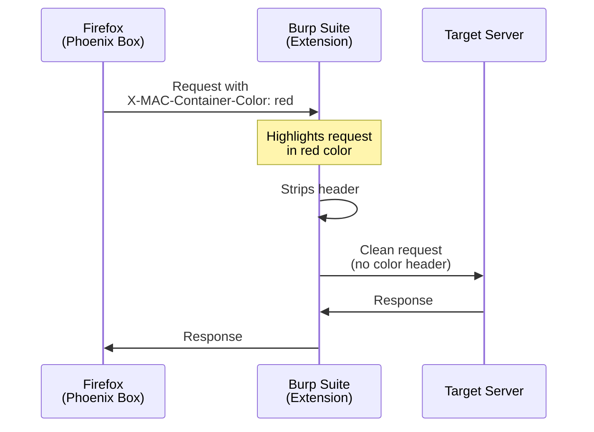

# Burp Suite Integration Guide

Phoenix Box automatically adds `X-MAC-Container-Color` headers to HTTP requests, allowing you to visually distinguish traffic from different containers in Burp Suite.

## Requirements

To enable automatic request highlighting in Burp Suite, you **must** install the Phoenix Box Burp Extension (JAR file).

## Installation

### Step 1: Install the Burp Suite Extension

1. Download `PhoenixBoxHighlighter.jar` from the [PhoenixBox-Highlighter releases page](https://github.com/avihayf/PhoenixBox-Highlighter/releases/tag/v1.0.0)
2. Open Burp Suite
3. Go to **Extender** → **Extensions** → **Add**
4. Select **"Java"** as the extension type
5. Click **"Select file"** and choose the downloaded JAR file
6. Click **"Next"** to load the extension
7. Verify "Phoenix Box" appears in the extensions list with a checkmark

### Step 2: Enable Container Color Headers in Firefox

1. Click the Phoenix Box icon in Firefox toolbar
2. Toggle **"Add container color header"** to ON
3. All requests from containers will now include the `X-MAC-Container-Color` header

### Step 3: Verify It Works

1. Open a new tab in the **Attacker** container (red)
2. Navigate to any website (e.g., `http://example.com`)
3. Check Burp Suite's **Proxy** → **HTTP history**
4. The request should be automatically highlighted in **red**
5. Repeat with other containers to see different colors

## How It Works

When both the Firefox extension and Burp extension are installed:

1. **Firefox Extension**: Adds `X-MAC-Container-Color` header to each request
2. **Burp Extension**: Reads the header value and auto-highlights the request
3. **Burp Extension**: Strips the header before forwarding to the target (for stealth)

## Color Mapping

The Burp extension automatically maps container colors to Burp's highlight colors:

| Container Color | Header Value | Burp Highlight |
|----------------|--------------|----------------|
| Blue           | `blue`       | Blue            |
| Turquoise      | `cyan`       | Cyan            |
| Green          | `green`      | Green           |
| Yellow         | `yellow`     | Yellow          |
| Orange         | `orange`     | Orange          |
| Red            | `red`        | Red             |
| Pink           | `pink`       | Pink            |
| Purple         | `magenta`    | Magenta         |

**Note**: The color mapping uses standard color names that Burp Suite recognizes. Turquoise containers map to Cyan highlighting, and Purple containers map to Magenta highlighting in Burp Suite.

## Troubleshooting

### Extension Not Loading in Burp

**Problem**: JAR file won't load or shows errors in Burp

**Solutions**:
- Ensure you're using Burp Suite with Java support (Community or Professional)
- Check Burp's **Extender** → **Output** tab for error messages
- Verify the JAR file is not corrupted (re-download if needed)
- Try restarting Burp Suite after loading the extension

### Headers Not Appearing

**Problem**: Requests don't include `X-MAC-Container-Color` header

**Solutions**:
- Verify "Add container color header" is enabled in Phoenix Box popup
- Check Firefox is routing traffic through Burp (proxy settings)
- Ensure you're opening tabs in a container (not regular tabs)
- Try disabling and re-enabling the header option

### Highlighting Not Working

**Problem**: Headers are present but requests aren't highlighted

**Solutions**:
- Confirm the Burp extension is loaded and active (check Extensions list)
- Check Burp's **Extender** → **Output** for extension logs
- Verify the extension has a checkmark (enabled) in the Extensions list
- Try unloading and reloading the extension

### Wrong Colors

**Problem**: Requests are highlighted but in wrong colors

**Solutions**:
- Verify container color in Phoenix Box matches expected color
- Check the `X-MAC-Container-Color` header value in Burp
- Burp's color mapping is case-insensitive
- Some Burp themes may display colors differently

### Headers Visible to Target

**Problem**: Target server sees the `X-MAC-Container-Color` header

**Solutions**:
- Ensure the Burp extension is loaded and active
- The extension automatically strips headers before forwarding
- If headers are still visible, check Burp's **Proxy** → **Options** → **Match and Replace** rules
- Verify no other Burp extensions are interfering

## Important Security Note

If you enable `X-MAC-Container-Color` without routing traffic through Burp, the header will be sent to the target server. This can reveal that you are using Phoenix Box and may leak role information such as `red` for an attacker workflow. For live targets, only enable this feature when the Burp extension is installed and actively stripping the header.

## Advanced Usage

### Manual Highlighting (Without Extension)

If you prefer not to use the Burp extension, you can manually configure highlighting:

1. Go to **Proxy** → **HTTP history**
2. Click the **Filter** bar
3. For each color, create a filter:
   - Header matches: `X-MAC-Container-Color: red`
   - Set highlight color to Red
4. Repeat for other colors

**Note**: Manual highlighting does NOT strip headers, so the target will see them.

### Custom Color Mapping

To modify color mappings, you would need to rebuild the JAR extension with custom logic. The source code for the extension maps header values directly to Burp's highlight colors.

### Integration with Logger++

The `X-MAC-Container-Color` header can also be used with Burp extensions like Logger++ for enhanced logging and filtering of requests by container.

## Benefits

- **Visual Traffic Separation**: Instantly identify which container sent each request
- **Session Management**: Track different user sessions/roles visually
- **Security Testing**: Separate attacker vs. victim traffic clearly
- **Debugging**: Identify cross-container leaks or mixed traffic
- **Reporting**: Color-coded Burp screenshots for penetration test reports
- **Stealth Mode**: Headers stripped before reaching target (with extension)

## Source Code

The Burp extension source code is available in the [PhoenixBox-Highlighter repository](https://github.com/avihayf/PhoenixBox-Highlighter). You can review or modify the code as needed for your specific use case.

## License

This guide and the Burp extension are part of Phoenix Box, licensed under MPL-2.0.
