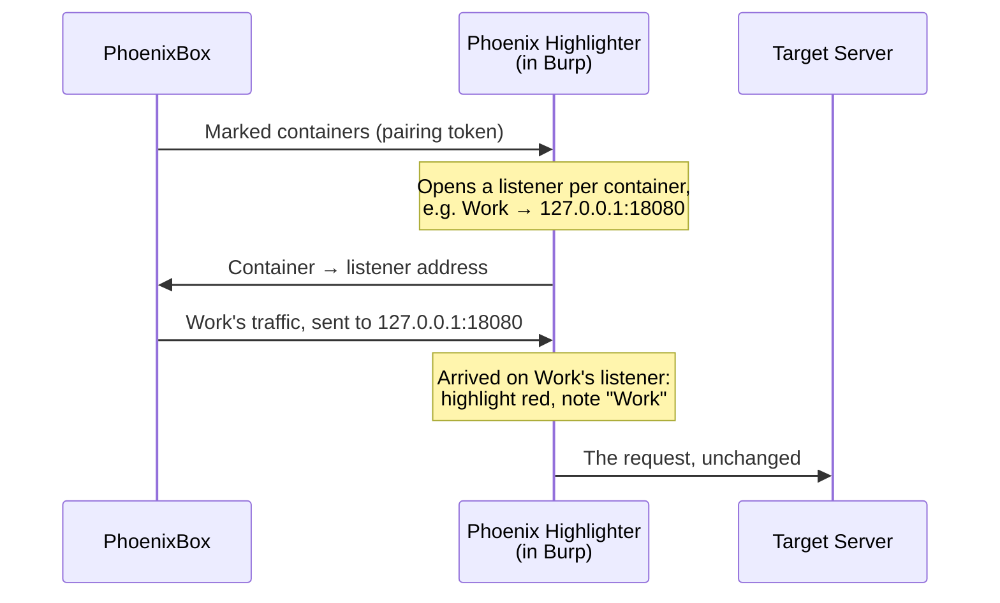

# Burp Suite Integration Setup

PhoenixBox colours your Burp Suite traffic by container, and notes which container each request came from, **without modifying any request**. Each container you mark for highlighting gets its own Burp proxy listener, and Burp knows the container from the listener a request arrives on.

## Requirements

- The PhoenixBox Burp extension, **Phoenix Highlighter v2.0.0 or later** (`PhoenixBoxHighlighter-2.0.0.jar`). Earlier JARs worked with request headers, which PhoenixBox no longer sends.
- Firefox traffic going through Burp, normally with PhoenixBox's **Burp Suite** proxy preset (`http://127.0.0.1:8080`).

## Setup

### 1. Load the Burp extension

1. Download the JAR from the [PhoenixBox-Highlighter releases page](https://github.com/avihayf/PhoenixBox-Highlighter/releases/latest).
2. In Burp, open **Extensions** → **Installed** → **Add**.
3. Set **Extension type** to **Java**, choose the JAR, and click **Next**.
4. Burp now has a **PhoenixBox** tab.

### 2. Pair PhoenixBox with Burp

1. In Burp's **PhoenixBox** tab, click **Copy** next to the pairing string. It looks like `phx1:127.0.0.1:8079:…`. Treat it like a password.
2. In the PhoenixBox popup, click the **Highlighter** tile, paste the string and click **Pair**.
3. The tile turns on once PhoenixBox reaches the Highlighter: *Connected to Highlighter v2.0.0 · 0 listeners*.

You only pair once. Click **New token** in Burp to revoke a pairing; PhoenixBox then needs the new string.

### 3. Mark containers

In the PhoenixBox container list, click the highlighter button next to **Promote** on each container you want coloured in Burp. Burp's **PhoenixBox** tab lists each marked container and its listener. Unmarking a container closes its listener.

Then browse in a marked container and open **Proxy** → **HTTP history**. Its requests are highlighted in the container's colour, and the **Notes** column shows the container name.

## How It Works

```mermaid
sequenceDiagram
    participant PB as PhoenixBox
    participant Jar as Phoenix Highlighter<br/>(in Burp)
    participant Target as Target Server

    PB->>Jar: Marked containers (pairing token)
    Note over Jar: Opens a listener per container,<br/>e.g. Work → 127.0.0.1:18080
    Jar->>PB: Container → listener address
    PB->>Jar: Work's traffic, sent to 127.0.0.1:18080
    Note over Jar: Arrived on Work's listener:<br/>highlight red, note "Work"
    Jar->>Target: The request, unchanged
```

- PhoenixBox re-sends the full list of marked containers whenever it changes, and every 30 seconds.
- If Burp hears nothing for two minutes (Firefox closed), it closes the listeners. They come back when Firefox starts again. After Burp or the Highlighter restarts, PhoenixBox reconnects within about 5 seconds and the listeners reappear on the same ports: there's no need to re-mark anything.
- PhoenixBox routes a container to its listener only after Burp confirms the listener is up. Otherwise the container's traffic goes to the preset listener as usual, just not highlighted.
- **Promote still decides what reaches Burp.** Marking only chooses which listener a container's Burp traffic arrives on. A marked container that isn't routed to Burp doesn't show up there.

## Listener Addresses

By default a container's listener uses the **Burp preset's IP**, with the first free port from **18080** upward. The Highlighter never uses:

- the Burp preset's own address,
- any listener already set up in Burp (one on *all interfaces* covers that port on every IP),
- its own control port (8079–8099),
- a port another program already holds, e.g. a dev server on `127.0.0.1:18080`. The Highlighter checks this before opening a listener.

A container keeps its address and gets the same one back the next time it's marked, if it's still free.

### Pinning a container to an address

Open a marked container in PhoenixBox and enter an address under **Burp Listener**, e.g. `192.168.10.5:8080`. Clear it to go back to automatic.

- If you already made a listener at that address in Burp, perhaps with invisible proxying or a custom certificate, the Highlighter **uses it as-is and never changes or removes it**.
- Otherwise the Highlighter creates it. The IP must belong to the machine Burp runs on.
- If the address can't be used, the container shows why and isn't routed there. A pin never silently falls back.

**Burp on another machine:** use that machine's address in the **Burp Suite** preset (e.g. `http://192.168.10.2:8080`) and in Burp's own proxy listener. The Highlighter's control server listens on the same IP as Burp's first listener, so Firefox reaches it wherever it reaches Burp. Listeners on non-loopback addresses accept connections from other machines on that network.

## Color Mapping

| Container colour | Burp highlight |
|------------------|----------------|
| Blue             | Blue           |
| Turquoise        | Cyan           |
| Green            | Green          |
| Yellow           | Yellow         |
| Orange           | Orange         |
| Red              | Red            |
| Pink             | Pink           |
| Purple           | Magenta        |

Firefox's ninth colour, *toolbar*, has no Burp equivalent: such a container still gets a listener and a note, but no highlight.

## Troubleshooting

**The Highlighter tile stays off / "Can't reach the Highlighter"**
- Is Burp running with Phoenix Highlighter v2.0.0+ loaded? Check **Extensions** → **Installed** and the **PhoenixBox** tab.
- Pair again with the string currently shown in Burp.
- If the PhoenixBox tab says the control server isn't running, ports 8079–8099 are all taken on that IP.

**"Burp rejected the pairing token"**
- The token was regenerated in Burp. Copy the new pairing string.

**A marked container isn't highlighted**
- Is its traffic going to Burp at all? The Burp preset must be the proxy in use, and if you promote containers, this one must be promoted.
- Hover its highlighter button, or open the container: an error there says why it has no listener (e.g. a pinned address is in use).
- Check the container's row in Burp's **PhoenixBox** tab.

**A dev server says its port is in use**
- Burp may be holding it for a container listener. Automatic listeners start at 18080 to avoid common dev ports; pin the container elsewhere, or start the dev server first. The Highlighter skips ports that are already taken.

**Old `X-MAC-Container-*` headers**
- PhoenixBox no longer adds them. Phoenix Highlighter still strips them if an older PhoenixBox sends them.

## Source Code

The Burp extension source code is available in the [PhoenixBox-Highlighter repository](https://github.com/avihayf/PhoenixBox-Highlighter).

## License

This guide and the Burp extension are part of PhoenixBox, licensed under MPL-2.0.
