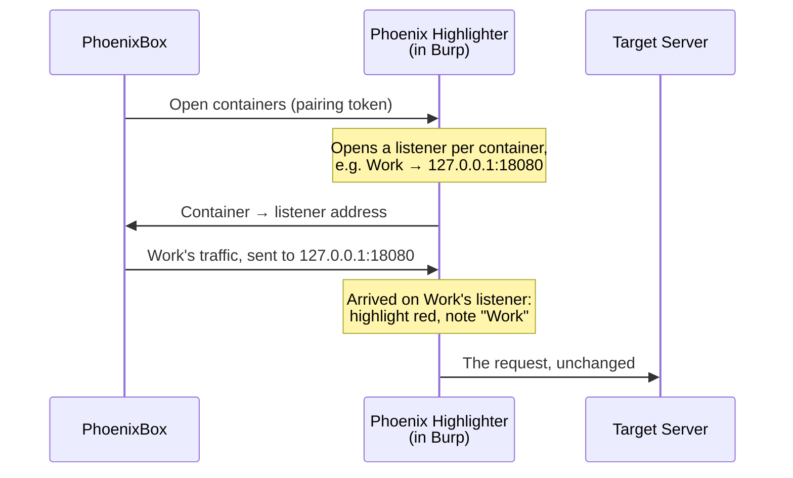

# Burp Suite Integration Setup

PhoenixBox colours your Burp Suite traffic by container, and notes which container each request came from. It works in one of two modes:

| | Paired with Phoenix Highlighter **v2.0.0+** | Not paired (Highlighter **v1.x**, or unpaired v2) |
|---|---|---|
| How Burp knows the container | the Burp listener the request arrives on (one per container with an open tab) | an `X-MAC-Container-Color` header PhoenixBox adds |
| Requests modified | **no** | the colour header, which the Highlighter strips |
| Burp shows | the container's colour, and its name in **Notes** | the container's colour only |
| With no Highlighter loaded | — | **the colour header reaches the site** |

Pairing is automatic: PhoenixBox finds the v2 Highlighter and asks, and you click **Allow** once in Burp.

## Requirements

- The PhoenixBox Burp extension, **Phoenix Highlighter v2.0.0 or later** for the paired mode. v1.x keeps working in the legacy colour-header mode.
- Firefox traffic going through Burp, normally with PhoenixBox's **Burp Suite** proxy preset (`http://127.0.0.1:8080`).

## Setup

### 1. Load the Burp extension

1. Download the JAR from the [PhoenixBox-Highlighter releases page](https://github.com/avihayf/PhoenixBox-Highlighter/releases/latest).
2. In Burp, open **Extensions** → **Installed** → **Add**.
3. Set **Extension type** to **Java**, choose the JAR, and click **Next**.
4. Burp now has a **PhoenixBox** tab.

### 2. Turn on the Highlighter, and allow pairing

1. Select the **Burp Suite** proxy preset in PhoenixBox.
2. Turn on the **Highlighter** tile in the Burp / Proxy section. Its gear opens the pairing window.
3. PhoenixBox finds the Highlighter on your Burp host and asks to pair. Open Burp's **PhoenixBox** tab: the request is at the top, with the requesting extension's origin. Click **Allow**.
4. The pairing window says *Connected to Highlighter v2.0.0*, with one listener per open container.

Only one PhoenixBox is paired at a time: allowing a new one, such as another Firefox profile, replaces the previous pairing. Burp's **PhoenixBox** tab shows who is paired, with **Unpair**. Unpairing there makes PhoenixBox fall back to the legacy mode and ask again. **Unpair** in PhoenixBox's Highlighter window stops it asking until you press **Connect**.

If PhoenixBox can't find Burp (for example Burp's proxy isn't the Burp Suite preset), use the fallback: copy the **manual pairing string** from Burp's **PhoenixBox** tab into **Highlighter → Pair manually**.

Burp's **PhoenixBox** tab lists each open container and its listener. A container's listener opens with its first tab and closes 15 seconds after its last one. Turning the Highlighter off closes them all at once.

Then browse in a container and open **Proxy** → **HTTP history**. Its requests are highlighted in the container's colour, and the **Notes** column shows the container name.

## How It Works

```mermaid
sequenceDiagram
    participant PB as PhoenixBox
    participant Jar as Phoenix Highlighter<br/>(in Burp)
    participant Target as Target Server

    PB->>Jar: Open containers (pairing token)
    Note over Jar: Opens a listener per container,<br/>e.g. Work → 127.0.0.1:18080
    Jar->>PB: Container → listener address
    PB->>Jar: Work's traffic, sent to 127.0.0.1:18080
    Note over Jar: Arrived on Work's listener:<br/>highlight red, note "Work"
    Jar->>Target: The request, unchanged
```

- PhoenixBox re-sends the full list of open containers whenever it changes, and every 10 seconds.
- **Why the 15-second grace:** each time the set of listeners changes, Burp recreates all of its listeners, your own included. Keeping a closed container's listener for 15 seconds means a quick reopen, or closing and reopening a window, doesn't make Burp do that twice. Opening many tabs at once (a restored session) changes the listeners in one go.
- **Closing Firefox's last window** closes the container listeners 15 seconds later, leaving only your own (e.g. `127.0.0.1:8080`). If Firefox quits or crashes, Burp closes them after 30 seconds without a check-in, and goes back to legacy mode.
- After Burp or the Highlighter restarts, PhoenixBox reconnects within about 5 seconds. The listeners reappear on the same ports.
- A container's very first request can arrive before Burp has opened its listener. PhoenixBox waits up to 1.5 seconds for it; after that, the request goes to the preset listener, not highlighted.
- PhoenixBox routes a container to its listener only after Burp confirms the listener is up. Otherwise the container's traffic goes to the preset listener as usual, just not highlighted.
- **Promote still decides what reaches Burp.** The Highlighter only chooses which listener a container's Burp traffic arrives on. A container that isn't routed to Burp doesn't show up there, though it still has a listener while it is open.

## Listener Addresses

By default a container's listener uses the **Burp preset's IP**, with the first free port from **18080** upward. The Highlighter never uses:

- the Burp preset's own address,
- any listener already set up in Burp (one on *all interfaces* covers that port on every IP),
- its own control port (8079–8099),
- a port another program already holds, e.g. a dev server on `127.0.0.1:18080`. The Highlighter checks this before opening a listener.

A container keeps its address and gets the same one back the next time it opens, if it's still free.

### Pinning a container to an address

With the Highlighter on, open a container in PhoenixBox and enter an address under **Burp Listener**, e.g. `192.168.10.5:8080`. Clear it to go back to automatic.

- If you already made a listener at that address in Burp, perhaps with invisible proxying or a custom certificate, the Highlighter **uses it as-is and never changes or removes it**.
- Otherwise the Highlighter creates it. The IP must belong to the machine Burp runs on.
- If the address can't be used, the container shows why and isn't routed there. A pin never silently falls back.

**Burp on another machine:** use that machine's address in the **Burp Suite** preset (e.g. `http://192.168.10.2:8080`) and in Burp's own proxy listener. The Highlighter's control server listens on the same IP as Burp's first listener, so Firefox reaches it wherever it reaches Burp. Listeners on non-loopback addresses accept connections from other machines on that network.

## Color Mapping

| Container colour | Burp highlight |
|------------------|----------------|
| Blue             | Blue           |
| Turquoise        | Cyan           |
| Green            | Green          |
| Yellow           | Yellow         |
| Orange           | Orange         |
| Red              | Red            |
| Pink             | Pink           |
| Purple           | Magenta        |

Firefox's ninth colour, *toolbar*, has no Burp equivalent: such a container still gets a listener and a note, but no highlight.

## Troubleshooting

**The Highlighter tile stays off / "No Phoenix Highlighter v2 found"**
- Is Burp running with Phoenix Highlighter v2.0.0+ loaded? Check **Extensions** → **Installed** and the **PhoenixBox** tab. With v1.x, legacy mode is expected.
- Is the **Burp Suite** preset the proxy you use? Discovery looks on that preset's host.
- Press **Connect** in the Highlighter window to look again right away.
- If the PhoenixBox tab says the control server isn't running, ports 8079–8099 are all taken on that IP. Use **Pair manually** once it's running.

**"Pairing was denied in Burp"**
- Press **Connect** to ask again, and click **Allow** this time.

**A container isn't highlighted**
- Is its traffic going to Burp at all? The Burp preset must be the proxy in use, and if you promote containers, this one must be promoted.
- Is the Highlighter tile on? Open the container: **Burp Listener** shows its address, or an error saying why it has none (e.g. a pinned address is in use).
- Check the container's row in Burp's **PhoenixBox** tab.

**A dev server says its port is in use**
- Burp may be holding it for a container listener. Automatic listeners start at 18080 to avoid common dev ports; pin the container elsewhere, or start the dev server first. The Highlighter skips ports that are already taken.

**`X-MAC-Container-Color` reached a site**
- That happens only while PhoenixBox isn't paired and no Highlighter is loaded in Burp. Load the Highlighter (v2 pairs automatically), or unmark the containers.
- While paired, the v2 Highlighter doesn't strip `X-MAC-*` headers, since PhoenixBox doesn't send them. Another browser profile using the same Burp without pairing would get its headers through.

## Source Code

The Burp extension source code is available in the [PhoenixBox-Highlighter repository](https://github.com/avihayf/PhoenixBox-Highlighter).

## License

This guide and the Burp extension are part of PhoenixBox, licensed under MPL-2.0.
